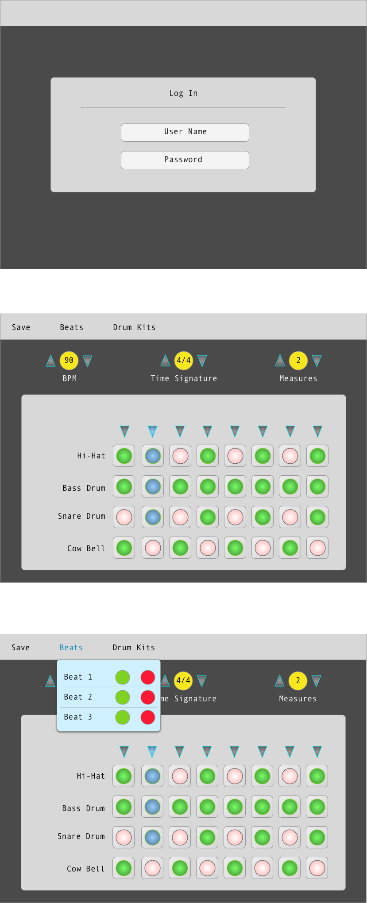

# Project-4

I will be creating a drum machine using Angular. This app will let users log into the user database, allowing them to create their own drum beats, access saved drum beats, update saved beats, or delete past projects. As stretch goals, I want to allow users to be able to adjust BPM, time signatures, and number of measures. I would also like to be able to add additional musical components.

